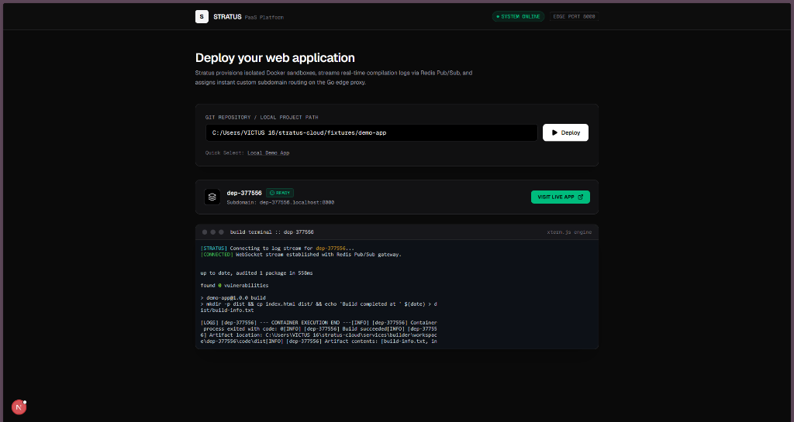
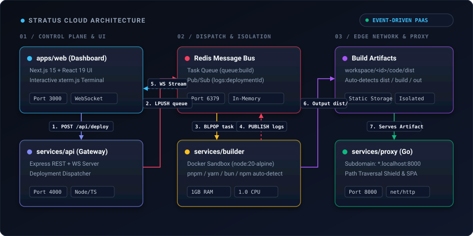
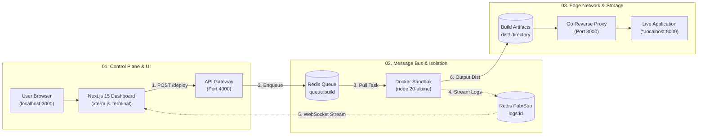

# Stratus Cloud

<p align="left">
  
  
  
  
  
  <a href="LICENSE"></a>
</p>

> A lightweight, self-hosted Cloud Deployment Platform (Mini-Vercel / PaaS) built from scratch with Next.js 15, Go, Docker, and Redis.



Stratus Cloud is an educational, production-modeled Platform-as-a-Service (PaaS). It automates the entire lifecycle of web applications: pulling Git repositories, executing isolated builds inside ephemeral Docker containers, streaming compilation logs in real time to the browser, and serving deployments through a high-performance Go reverse proxy with dynamic subdomain routing.

---

## Key Architectural Highlights

* **Polyglot Monorepo Design:** Clean separation of concerns featuring a Next.js 15 UI, a TypeScript Builder & Orchestrator, and a high-performance edge proxy written in Go.
* **Isolated Ephemeral Sandboxes:** Every build executes inside a throwaway Docker container (`node:20-alpine`) with strict resource constraints (1GB RAM, 1.0 CPU quota) to isolate and shield the host from malicious supply-chain scripts.
* **Intelligent Package Manager Auto-Detection:** Inspects project root files on the fly and dynamically switches between `pnpm`, `yarn`, `bun`, and `npm` without requiring manual configuration.
* **High-Performance Go Edge Proxy:** Built with 100% Go Standard Library (`net/http`). Handles dynamic subdomain routing (`*.localhost:8000`), RFC 6761 localhost wildcard resolution, Path Traversal security guards, and Single Page Application (SPA) client-side routing fallbacks.
* **Decoupled Real-Time Log Pipeline:** Completely separates build workers from web clients using Redis Pub/Sub channels and WebSockets, streaming container `stdout`/`stderr` line-by-line directly to an embedded `xterm.js` terminal emulator.

---

## Distributed System Architecture

<p align="center">
  
</p>

<details>
<summary><b>View Architecture Execution Pipeline Breakdown</b></summary>

### Sequential Execution Matrix

| Stage | Source → Target | Action | Transport / Protocol |
| :--- | :--- | :--- | :--- |
| **1. Ingest** | `apps/web` → `services/api` | Dispatches deployment trigger | HTTP POST (`/api/deploy`) |
| **2. Enqueue** | `services/api` → Redis | Pushes task to background queue | Redis `LPUSH queue:build` |
| **3. Dequeue** | Redis → `services/builder` | Worker pulls next available task | Redis `BLPOP queue:build` |
| **4. Sandbox** | `services/builder` → Docker | Provisions ephemeral container | Docker Engine API (`node:20-alpine`) |
| **5. Stream** | Docker → Redis Pub/Sub | Publishes real-time build logs | Redis `PUBLISH logs:<id>` |
| **6. Relay** | Redis Pub/Sub → `apps/web` | Forwards log stream to UI | WebSockets (`ws://localhost:4000`) |
| **7. Export** | `services/builder` → Storage | Verifies output directory (`dist/`) | Local Workspace Cache |
| **8. Serve** | Client → `services/proxy` | Routes requests by subdomain | Go Reverse Proxy (`:8000`) |

### Topology Flowchart



</details>

---

## Repository Structure

```text
stratus-cloud/
├── apps/
│   └── web/              # Next.js 15 Developer Dashboard with xterm.js
├── services/
│   ├── api/              # REST Orchestrator API & WebSocket Gateway (Node/TS)
│   ├── builder/          # Docker Sandbox Build Engine (Dockerode)
│   └── proxy/            # High-Performance Edge Reverse Proxy (Go)
├── fixtures/
│   └── demo-app/         # Minimal, zero-bloat test application
└── assets/               # Architecture diagrams and preview assets
```

---

## Getting Started

### Prerequisites
* [Node.js](https://nodejs.org/) v20+
* [Go](https://go.dev/) v1.22+
* [Docker Desktop](https://www.docker.com/products/docker-desktop/) (Engine running)
* [Git](https://git-scm.com/)

### 1. Start Redis Message Broker
```bash
docker run -d --name stratus-redis -p 6379:6379 redis:alpine
```

### 2. Start the Go Edge Proxy (Port 8000)
```bash
cd services/proxy
go run main.go
```

### 3. Start the Builder Worker Daemon
```bash
cd services/builder
npm install
npx tsx src/index.ts
```

### 4. Start the API & WebSocket Gateway (Port 4000)
```bash
cd services/api
npm install
npx tsx src/index.ts
```

### 5. Start the Developer Dashboard (Port 3000)
```bash
cd apps/web
npm install
npm run dev
```

Open [http://localhost:3000](http://localhost:3000) in your browser, enter any Git repository or local fixture path (`fixtures/demo-app`), click **Deploy**, and watch your application build and deploy with live streaming logs.

---

## Engineering Design Decisions

| Subsystem | Technology | Architectural Rationale |
| :--- | :--- | :--- |
| **Edge Reverse Proxy** | **Go (`net/http`)** | Sub-millisecond latency, ~15MB memory footprint, concurrent Goroutine request dispatching, and zero third-party dependencies (modeled after Traefik/Caddy). Hardened with path traversal guards and production HTTP timeouts. |
| **Sandbox Execution** | **Docker Engine API (`dockerode`)** | Full container isolation for untrusted user code. Enforces 1GB memory limits, CPU quotas, and ephemeral container cleanup upon build exit. |
| **Message Broker & Logs** | **Redis (Queue + Pub/Sub)** | Decouples the build worker fleet from the WebSocket gateway. Allows independent horizontal scaling of workers across multiple machines. |
| **Developer Dashboard** | **Next.js 15 + xterm.js** | Server-side rendering paired with client-side interactive terminal emulator via WebSockets for raw container `stdout`/`stderr` streaming. |

---

## Security Guardrails

1. **Path Traversal Shield:** The Go Edge Proxy verifies that all requested static assets resolve strictly within the deployment's `dist/` directory via `filepath.Rel()`. Any attempt to escape the directory is denied with HTTP 403.
2. **Subdomain Strict Regex:** Subdomains are sanitized with `^[a-zA-Z0-9_-]+$` preventing injection of directory traversal separators in the `Host` header.
3. **Slowloris & Timeout Protection:** The HTTP server configures strict `ReadHeaderTimeout`, `ReadTimeout`, `WriteTimeout`, and `IdleTimeout` bounds to mitigate socket exhaustion attacks.
4. **Sandboxed Build Isolation:** User-submitted repositories never execute on the host machine. All `npm install` and build scripts run within memory-limited, unprivileged Alpine containers.

---

## License

Distributed under the [MIT License](LICENSE). Maintained by [Rusdan Lamsa (@gxmngi)](https://github.com/gxmngi).